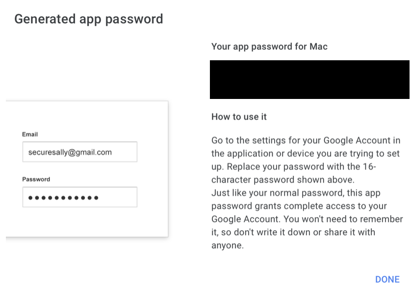

# Prefect

# Tasks and Flows

Task and flows are two of the main concepts in Prefect. A task is a single unit of work and a flow is a collection of tasks that are executed together. To create a task, the simplest way is to use the `task` decorator to annotate a function.

```python
from prefect import task

@task(name="Add two numbers", retry_delay_seconds=2, retries=3)
def add(x: int, y: int) -> int:
    # Simulate a random error.
    if random.random() < 0.2:
        raise ValueError("Something went wrong")
    return x + y
```

In the `task` decorator, we can define the name of the task, the retry delay and the number of retries. The latter two are useful when the task is interacting with an external system that may be temporarily unavailable.

Same as tasks, flows can be created using the `flow` decorator. 

```python
from prefect import flow

@flow(name="Main flow")
def main_flow(number_a: int=1, number_b: int=1) -> int:
    return add(number_a, number_b)

if __main__ == "__main__":
    main_flow()
```

The file `add_two_numbers.py` contains the code for the task and flow above. Use the command to run the Flow.

```bash
python add_two_numbers.py
```

# Local Prefect Server

After running the script, we can check the log from the Prefect UI. To do so, we need to start a local Prefect server.

```bash
prefect server start
```

Click the tab Flows runs to check out the log. We can see that though an error occured, by the implementation of retries, the Flow still completed.

<p align="center"></p>

# Blocks

Prefect Blocks offer a way to interact with external systems. To use blocks for a certain external system, we need to install the corresponding package. For example, to use the `AWSCredentials` block, which is used to manage authentication with AWS, we need to install the `prefect[aws]` package.

## AwsCredentials Block

To create an `AWSCredentials` block, we have to send the AWS access key and secret access key. However, it is NOT recommended to hardcode credential keys in the code. A simple solution is to store the keys in an `.env` file. By using `load_dotenv` provided by the package `python-dotenv`, we can use `os.getenv` function to get the keys from the environment variables. The code below shows how to create an `AwsCredentials` block from an `.env` file.

Note that the `.env` should not be tracked by version control systems. To inform other developers of the required environment variables, we can create a `.env_example` file that contains the names of the environment variables and empty values.

```
# .env
AWS_ACCESS_KEY_ID=<Your AWS access key>
AWS_SECRET_ACCESS_KEY=<Your AWS secret access key>
```

```python
import os

from dotenv import load_dotenv
from prefect_aws import AwsCredentials

load_dotenv(".env")

aws_creds_block = AwsCredentials(
    aws_access_key_id=os.getenv("AWS_ACCESS_KEY_ID"),
    aws_secret_access_key=os.getenv("AWS_SECRET_ACCESS_KEY"),
)
aws_creds_block.save(name="aws-credentials", overwrite=True)
```

## S3Bucket Block

`S3Bucket` is used to interact with an S3 bucket. The code below shows how to create an `S3Bucket` block with the `AwsCredentials` block created above.

```python
from prefect_aws import AwsCredentials, S3Bucket

aws_creds_block = AwsCredentials.load("aws-credentials")
# The bucket name is a bucket existing in your S3.
s3_bucket_block = S3Bucket(
    bucket_name="nyc-taxi-trips-data", credentials=aws_creds_block
)
s3_bucket_block.save(name="aws-s3", overwrite=True)
```

After creating the `S3Bucket` block, we can use it to interact with the S3 bucket. For example, `download_folder_to_path` can be used to download a folder from the S3 bucket to a local path.

```python
s3_bucket_block = S3Bucket.load("aws-s3")
s3_bucket_block.download_folder_to_path(from_folder="data", to_folder=data_folder)
```

## EmailServerCredentials

`EmailServerCredentials` is used to manage credentials with an email server (The package  `prefect-email` should be installed). In this example, we use Gmail as the email server. Like many email services, Gmail requires an App Password to send emails. To create an App Password, go to [https://myaccount.google.com/security] and enable 2-Step Verification. Then, go to [https://myaccount.google.com/apppasswords] to create an App Password. Select Other (Custom name) as the app and give it a name. A 16-digit App Password will be generated. 

<p align="center"></p>  
<p align="center"></p>  
<p align="center"></p>  

We can store the email address and the App Password in the `.env` file. The code below shows how to create an `EmailServerCredentials` block by the credentials.

```python
import os

from dotenv import load_dotenv
from prefect_email import EmailServerCredentials

load_dotenv(".env")

credentials = EmailServerCredentials(
    username=os.getenv("EMAIL_ADDRESS"),
    password=os.getenv("EMAIL_PASSWORD"),
)
credentials.save("email-server-credentials-block", overwrite=True)
```

With the `EmailServerCredentials` block, we can send emails using the `email_send_message` function.

```python
from prefect_email import EmailServerCredentials, email_send_message

email_server_credentials = EmailServerCredentials.load(
        "email-server-credentials-block"
    )
    email_send_message(
        email_server_credentials=email_server_credentials,
        subject="Flow successfully completed.",
        msg="Flow successfully completed.",
        email_to=email_server_credentials.username,
    )
```

# Artifacts

Artifacts enable us to track and monitor the outputs that a Flow produces and update over time. The code below demonstrates how to create an markdown artifact tracking mean square error by using the `create_markdown_artifact` function. Furthermore, we wrap the function in a task so that it can be used in a flow.

```python
@task()
def markdown_task(rmse: float) -> None:
    markdown_report = f"""# RMSE Report

        ## Summary

        Duration Prediction 

        ## RMSE  Model

        | Region    | RMSE |
        |:----------|-------:|
        | {date.today()} | {rmse:.2f} |
    """

    create_markdown_artifact(key="duration-model-report", markdown=markdown_report)
```

# Deployments

A deployment encapsulates a flow and its environment so the flow can be scheduled and triggered by the Prefect API and run remotely by a Prefect agent. 

## Work pools

Work pools manage the resources that are available to run flows. When a deployment creates a flow run, a worker or agent will be assigned to run the flow. A work pool can be created by the command below. The type *process* means that flow runs will be executed by a local process.  

```bash
 prefect work-pool create --type process <Work Pool Name>
```

## Deploying a flow

To simplify the deployment, we can initiate a project by the command below. 

```bash
prefect project init
```

The command will create a project with the following new files:

1. prefect.yaml
2. deployment.yaml
3. .prefectignore
4. .prefect/

The first two files are used to configure the project and the deployment. The third file is used to ignore files and directories when deploying the project. The last file is a directory that contains the flow and its dependencies.

Take the file `orchestrate_duration_prediction.py` in this folder as an example. If we want to deploy the `main_flow()`, the *prefect.yaml* should be configured as below. By the configuration in pull section, the code will be pulled from the specified GitHub repository when the flow is triggered.

```yaml
# Generic metadata about this project
name: mlops_zoomcamp
prefect-version: 2.10.12

... # other configurations, see the original file for details

# pull section allows you to provide instructions for cloning this project in remote locations
pull:
- prefect.projects.steps.git_clone_project:
    repository: https://github.com/slchangtw/mlops_zoomcamp.git
    branch: main
    access_token: null
```

In the *deployment.yaml*, we need to specify the work pool and schedule that will be used to run the flow. 

```yaml
deployments:
- name: duration_prediction
  entrypoint: 03-orchestration/orchestrate_duration_prediction.py:main_flow
  schedule:
    cron: 0 9 3 * * 
  work_pool:
    name: trips_prediction_pool
```

After the configuration, we can deploy the flow by the command below. We then can see the deployment in the Prefect UI.

```bash
prefect deploy --all
```

<p align="center"></p>  

To enable the flow run, we need to start a agent from the work pool.

```bash
prefect worker start -p trips_prediction_pool
```

In addition to scheduled flow runs, we can trigger the flow run by clicking *Quick run* from the UI. After the flow run is completed, we can see the result in the UI.

<p align="center"></p>
<p align="center"></p>

# Prefect Cloud

 